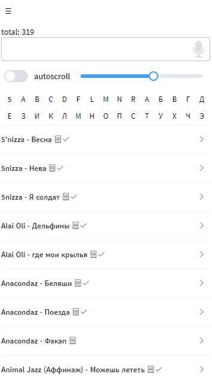

# chords-viewer

## Russian
Смотрелка для chords.json, сгенерированного через [chords-parser](https://github.com/popstas/chords-parser).

Мои аккорды: https://chords.popstas.ru



### Возможности

#### Просмотр аккордов:
- Аккорды фиксируются при промотке песни и всегда видны
- При наведении на аккорд показывается аппликатура
- Транспонирование аккордов (`Ctrl+вверх/вниз`)
- Подсветка куплетов и припевов

#### Для просмотра на мобильном
- Сайт можно установить как приложение (PWA)
- Сайт может работать без интернета, если хоть раз на него зайти
- Автопрокрутка текста с настройкой скорости (`пробел`)
- Режим "не спать" для телефонов

#### Поиск
- Поиск по названию или словам из песни
- Быстрый переход по первой букве имени исполнителя
- Выбор жанра
- Выбор исполнителя
- Голосовой поиск
- Поиск на amdm.ru
 
#### Переключение песен:
- Переключение между песнями назад-вперед (`влево/вправо`, `j/k`)
- Выбор случайной песни
- Отображение сложности песни

#### Сортировка
- По алфавиту
- По дате добавления
- По просмотрам

#### Статистика
- Песня считается просмотренной, если открыта дольше 1 минуты
- Авторизация через Google аккаунт позволяет сохранять и синхронизировать просмотры


---

### Требования
Чтобы собрать, нужно положить `chords.json` в корень проекта.
Данные моих аккордов лежат на github и могут быть скачаны через `npm run update-data`.

### Технические особенности
Проект интересен тем, что отображает базу из сотен аккордов, имеет авторизацию и счётчик просмотров (для каждого пользователя свой), но при этом не имеет серверной части.

Сайт и база аккордов хостятся на GitHub Pages, авторизация и счётчик просмотров сделан через Google Firebase.

Сайт - PWA приложение на Nuxt, Element UI.


## English
View chords.json generated with [chords-parser](https://github.com/popstas/chords-parser).

### Features
- Fixed chords while scroll
- Search by title and lyrics
- Quick search by first letter of title
- Voice search
- Search on amdm.ru
- Autoscroll with speed control
- Change font size without zoom
- Transpose chords
- Chords images
- Random song
- Select prev/next song
- Hotkeys (j/k, arrows, space)
- No sleep mode for phones
- Single Page Application
- Static site, hosted anywhere
- PWA (offline access, when deployed to https domain)
- Highlight odd chords sequences
- Display song complexity
- Share song via QR code without internet
- Dark mode

### Requirements
`chords.json` should be placed in project root. You can download my data with command `npm run update-data`.


## Webhook on song show
Enter your url to query input:

```
webhookShow=https://your-https-url
```

Webhook fire after 60 seconds of song view.


## Build Setup

You should use yarn!

``` bash
# install dependencies
npm install
npm run update-data

# serve with hot reload at localhost:3001
$ npm run dev

# build for production and launch server
$ npm run build
$ npm start
```

## Full build of chords.popstas.ru

``` bash
git clone https://github.com/popstas/chords-parser.git
cd chords-parser
npm install
npm start
npm deploy

cd ..
git clone https://github.com/popstas/chords-viewer.git
yarn install
npm update-data
npm deploy
```

## New version

``` bash
npm version
```
